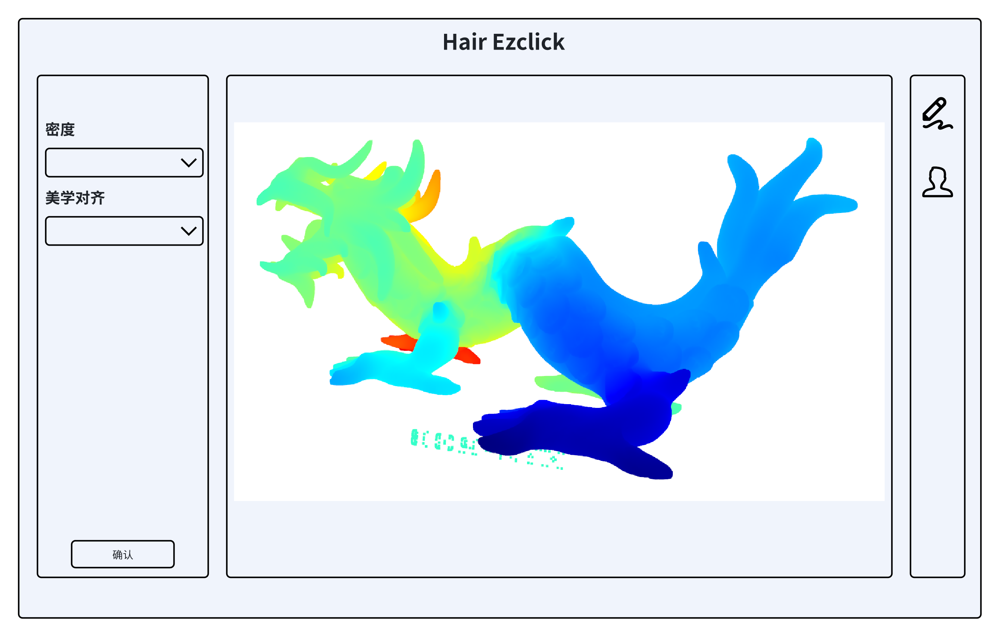

# open3d_ezclick
3d_hair

## 环境要求
* 操作系统：本项目是在Ubuntu 22.04环境下运行。
* Python: 3.8及以上。

## 安装指南
### 1. 创建虚拟环境
Miniconda安装，请根据conda官方网站下载。
```
conda create --name op_ezclick python=3.10
conda activate op_ezclick
```
### 2. 安装Open3D和PySide6
```
pip install open3d PySide6
```
## 运行项目
```
python3 xxxx.py #输入对应的py文件名称
```

最终效果：
