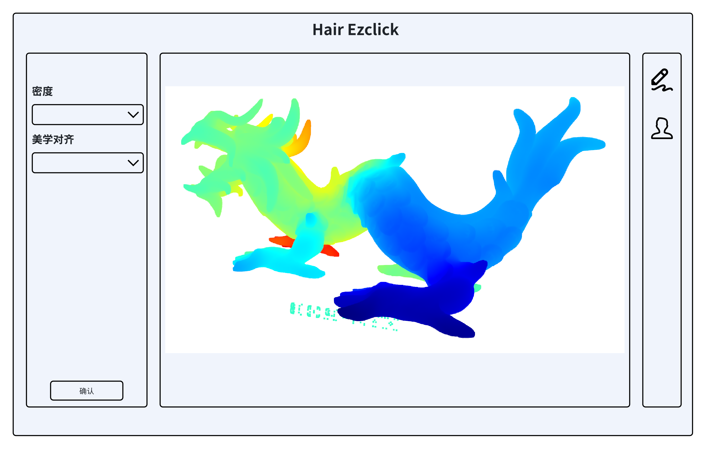
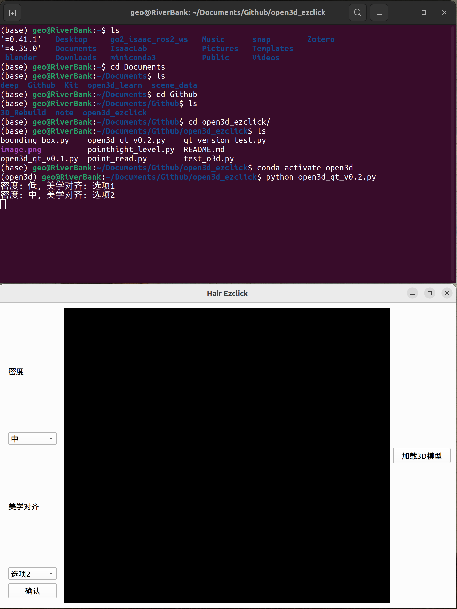
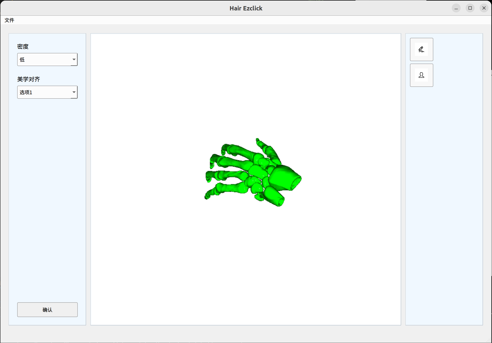

# open3d_ezclick
3d_hair

## 环境要求
* 操作系统：本项目是在Ubuntu 22.04环境下运行。
* Python: 3.8及以上。

## 安装指南
### 1. 创建虚拟环境
Miniconda安装，请根据conda官方网站下载。
```
conda create --name op_ezclick python=3.10
conda activate op_ezclick
```
### 2. 安装Open3D和PySide6
```
pip install open3d PySide6
```
## 运行项目
```
python3 xxxx.py #输入对应的py文件名称
```

最终效果：


最终的效果如下，但是现在没有办法解析选定3D文件。


我进一步的优化了代码，并且优化了UI界面的设计。


通过对比这两者的差异
<details>
  <summary>v0.2与v0.4版本的差异分析</summary>

为什么离屏渲染方法能正常工作
这种方法主要有以下优点：

避免 OpenGL 上下文冲突：Open3D 和 Qt 各自使用自己的 OpenGL 上下文，不会互相干扰。
清晰的渲染流程：

Open3D 在不可见窗口中渲染
通过 capture_screen_float_buffer() 获取渲染结果
将结果转为图像显示在 Qt 界面上


可靠的更新机制：使用 QTimer 定期触发渲染更新，保证画面持续刷新。
信号-槽连接：使用 Qt 的信号-槽机制传递渲染结果，结构清晰。

为什么 QOpenGLWidget 方法不能正常工作
最初提到的代码尝试通过继承 QOpenGLWidget 来集成 Open3D，这种方法存在几个问题：

窗口重复创建：
pythonCopy# 在构造函数中创建一次
self.vis.create_window(window_name="Open3D Viewer", width=640, height=480, visible=False)

在 initializeGL 中又创建一次
self.vis.create_window(window_name="Open3D Window", width=640, height=480, visible=True)
Open3D 的 Visualizer 通常只应该创建一个窗口。
OpenGL 上下文竞争：

Qt 的 QOpenGLWidget 会创建并管理自己的 OpenGL 上下文
Open3D 的 Visualizer 也会创建并管理自己的 OpenGL 上下文
这两者会相互冲突，导致渲染问题


渲染同步问题：没有明确的机制来同步 Qt 和 Open3D 的渲染循环，可能导致渲染时机问题。
资源管理问题：没有明确的清理机制，可能导致资源泄漏。

正确集成 Open3D 和 Qt 的最佳实践
如果你想在 Qt 应用中集成 Open3D 渲染，离屏渲染方法（你提供的能正常工作的代码）是最可靠的选择，这种方法：

保持两个框架的独立性
避免 OpenGL 上下文冲突
通过图像传输来连接两个系统
提供清晰的渲染更新机制

这种方法虽然多了一步将渲染结果转换为图像的过程，但避免了许多复杂的底层 OpenGL 上下文管理问题，是更稳定可靠的解决方案。

