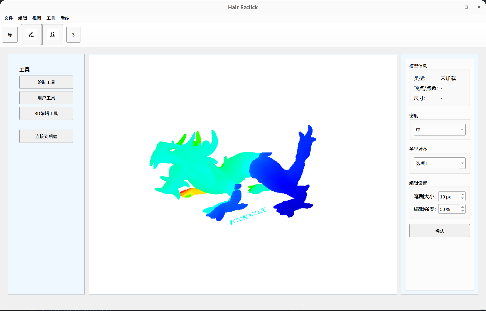

# Hair Ezclick

Hair Ezclick 是一个基于 Open3D 和 PySide6 的 3D 模型可视化与编辑工具，适用于头发模型的处理和编辑。后期将逐步丰富关于模型的编辑渲染等功能。
## 功能特点

- 支持加载、显示和操作 3D 点云和网格模型 (.pcd, .ply, .obj)
- 简洁、现代化的用户界面
- 模型导航（旋转、平移、缩放）功能
- 密度调整和美学对齐工具，后续将会继续开发。
- 未来计划从后端系统获取模型文件并集成，支持远程数据处理
- 为3D模型编辑预留扩展接口

## 环境要求

- 操作系统：Ubuntu 22.04 或其他支持 Open3D 的系统
- Python: 3.9 及以上

## 安装指南

### 1. 创建虚拟环境

使用 Miniconda 或 Anaconda 创建一个虚拟环境：

```bash
conda create --name open3d_ezclick python=3.9
conda activate open3d_ezclick
```


### 2. 安装脚本
为了方便安装，运行一下setup.sh。如果还有缺什么就再装。

```bash
chmod +x setup.sh
./setup.sh
```

## 项目结构

```
hair_ezclick/
│
├── run.py                       # 主程序入口
├── config.json                  # 配置文件（自动生成）
│
├── utils/                       # 工具模块
│   ├── __init__.py
│   ├── config_manager.py        # 配置管理
│   ├── data_interface.py        # 后端数据接口
│   └── model_manager.py         # 模型管理
│
├── gui/                         # 图形界面模块
│   ├── __init__.py
│   ├── main_window.py           # 主窗口
│   ├── viewport.py              # 3D视口
│   ├── image_view_widget.py     # 图像显示组件
│   ├── sidebar.py               # 侧边栏（属性面板和控制面板）
│   ├── toolbars.py              # 工具栏
│   └── styled_frame.py          # 自定义样式框架
│
├── renderer/                    # 渲染器模块
│   ├── __init__.py
│   └── open3d_renderer.py       # Open3D渲染器
│
└── icons/                       # 图标资源目录
    ├── nav_icon.png
    ├── pen_icon.png
    ├── user_icon.png
    └── edit3d_icon.png
```

## 运行项目

```bash
python run.py
```

### 模型无法拖动或交互

确保：
1. 已正确加载模型
2. 处于导航模式而非编辑模式
因为目前这个按钮的逻辑还是有点缺陷，将在后续优化。鼠标拖不动就关了重启。

## 使用指南

### 基本操作

1. **加载模型**：通过菜单栏的"文件 > 加载3D模型"加载模型文件
2. **导航模式**：
   - 左键拖动：旋转模型
   - 右键拖动：平移模型
   - 鼠标滚轮：缩放模型
3. **编辑工具**：点击工具栏上的按钮切换不同编辑工具，目前未明确定义
4. **调整参数**：在右侧属性面板中调整密度和美学对齐等参数，目前未明确定义
5. **保存/导出**：通过菜单栏的"文件 > 保存模型"或"文件 > 导出模型"保存处理结果，目前未明确定义

### 高级功能

- **撤销/重做**：使用快捷键 Ctrl+Z (撤销) 和 Ctrl+Y (重做)，或通过"编辑"菜单
- **连接后端**：通过"后端 > 连接到后端"连接到数据处理服务器


## 当前进度的UI展示



## 版本历史

- **v0.4**: 优化UI界面，增强工具功能，重构代码结构
- **v0.2**: 初始版本，实现基本的3D模型可视化功能

## 许可证

请参阅LICENSE文件了解更多信息。


<details>
  <summary>v0.2与v0.4版本的差异分析</summary>
最终效果：


最终的效果如下，但是现在没有办法解析选定3D文件。


我进一步的优化了代码，并且优化了UI界面的设计。


通过对比这两者的差异
为什么离屏渲染方法能正常工作
这种方法主要有以下优点：

避免 OpenGL 上下文冲突：Open3D 和 Qt 各自使用自己的 OpenGL 上下文，不会互相干扰。
清晰的渲染流程：

Open3D 在不可见窗口中渲染
通过 capture_screen_float_buffer() 获取渲染结果
将结果转为图像显示在 Qt 界面上


更新机制：使用 QTimer 定期触发渲染更新，保证画面持续刷新。
信号-槽连接：使用 Qt 的信号-槽机制传递渲染结果，结构清晰。

QOpenGLWidget 方法不能正常工作
最初的代码尝试通过继承 QOpenGLWidget 来集成 Open3D，这种方法存在几个问题：

窗口重复创建：
pythonCopy# 在构造函数中创建一次
self.vis.create_window(window_name="Open3D Viewer", width=640, height=480, visible=False)

在 initializeGL 中又创建一次
self.vis.create_window(window_name="Open3D Window", width=640, height=480, visible=True)
Open3D 的 Visualizer 通常只应该创建一个窗口。
OpenGL 上下文竞争：

Qt 的 QOpenGLWidget 会创建并管理自己的 OpenGL 上下文
Open3D 的 Visualizer 也会创建并管理自己的 OpenGL 上下文
这两者会相互冲突，导致渲染问题


渲染同步问题：没有明确的机制来同步 Qt 和 Open3D 的渲染循环，可能导致渲染时机问题。
资源管理问题：没有明确的清理机制，可能导致资源泄漏。

Qt 应用中集成 Open3D 渲染，离屏渲染方法是合适的就目前的情况，这种方法：

保持两个框架的独立性
避免 OpenGL 上下文冲突
通过图像传输来连接两个系统
提供清晰的渲染更新机制

这种方法虽然多了一步**将渲染结果转换为图像的过程**，但避免了许多复杂的底层 OpenGL 上下文管理问题，是更稳定可靠的解决方案。


进一步封装了整体的结构，区分开各个功能模块。
新增了工具窗口。

